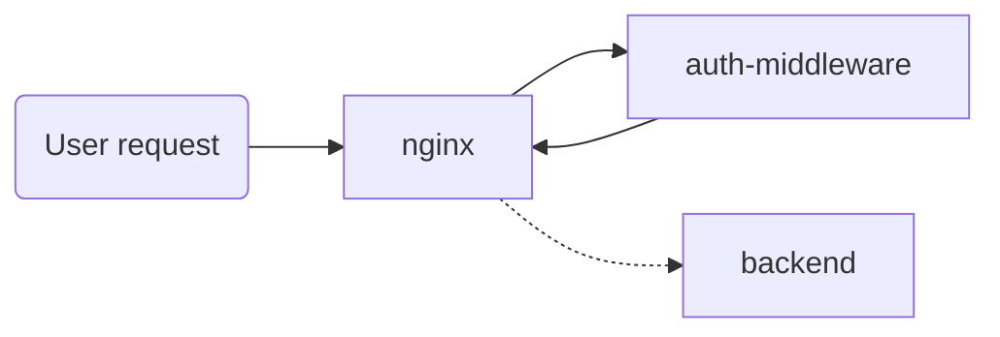

# auth-middleware

A tiny Google OIDC-compatible server designed for nginx's forward auth mode.



## Is this secure?

I believe so. However, even if it is, you should still have your backends verify the `Authorization`
token that gets passed through. Otherwise, anyone with access directly to your pods could
impersonate any user.

## Security concerns

Please email me directly at [april@escalante.bio](mailto:april@escalante.bio)

## Installation

### Building the proxy server

* Change the `repo` variable in `proxy/BUILD.bazel` to point at your container registry
* Run `bazel run //proxy:image_push` to push the image to your registry

### Generating secrets

* Generate your Google credentials at https://console.cloud.google.com/apis/credentials by creating
  a new "OAuth client ID". Be sure to include `https://auth.your-domain.com/login/callback` as an
  allowable callback URL.
* Generate random strings for `auth-secret` and `cookie-secret`
* Generate a signing key by running `openssl genrsa -out private.key 2048`

### Proxy deployment yaml

* Change `your-domain.com` to your domain

```yaml
apiVersion: apps/v1
kind: Deployment
metadata:
  name: auth-middleware
  labels:
    escalante.bio/app: auth-middleware
spec:
  replicas: 1
  selector:
    matchLabels:
      escalante.bio/app: auth-middleware
  template:
    metadata:
      labels:
        escalante.bio/app: auth-middleware
    spec:
      containers:
      - name: auth-middleware
        image: us-docker.pkg.dev/your-registry-here/your-path-here/proxy:latest
        env:
        - name: COOKIE_DOMAIN
          value: your-domain.com
        - name: ORGANIZATION_DOMAIN
          value: your-domain.com
        - name: PORT_HTTP
          value: "8080"
        - name: AUTH_SECRET
          valueFrom:
            secretKeyRef:
              name: auth-middleware
              key: auth-secret
        - name: COOKIE_SECRET
          valueFrom:
            secretKeyRef:
              name: auth-middleware
              key: cookie-secret
        - name: GOOGLE_CLIENT_ID
          valueFrom:
            secretKeyRef:
              name: auth-middleware
              key: google-client-id
        - name: GOOGLE_CLIENT_SECRET
          valueFrom:
            secretKeyRef:
              name: auth-middleware
              key: google-client-secret
        - name: SIGNING_KEY
          valueFrom:
            secretKeyRef:
              name: auth-middleware
              key: signing-key
        ports:
        - name: http
          containerPort: 8080

---

apiVersion: v1
kind: Secret
metadata:
  name: auth-middleware
stringData:
  auth-secret: replace-me
  cookie-secret: replace-me
  google-client-id: replace-me
  google-client-secret: replace-me
  signing-key: replace-me

---

apiVersion: v1
kind: Service
metadata:
  name: auth-middleware
spec:
  selector:
    escalante.bio/app: auth-middleware
  ports:
    - name: http
      protocol: TCP
      port: 80
      targetPort: http

---

apiVersion: networking.k8s.io/v1
kind: Ingress
metadata:
  name: auth-middleware
  annotations:
    nginx.ingress.kubernetes.io/force-ssl-redirect: "true"
spec:
  ingressClassName: nginx
  rules:
  - host: auth.your-domain.com
    http:
      paths:
      - path: /
        pathType: Prefix
        backend:
          service:
            name: auth-middleware
            port:
              name: http
```

### ingress-nginx-compatible ingress configuration

```yaml
apiVersion: networking.k8s.io/v1
kind: Ingress
metadata:
  name: protected-server
  annotations:
    nginx.ingress.kubernetes.io/auth-signin: "https://auth.your-domain.com/login?rd=$scheme%3A%2F%2F$http_host$escaped_request_uri"
    nginx.ingress.kubernetes.io/auth-url: "https://auth.your-domain.com/check"
    nginx.ingress.kubernetes.io/force-ssl-redirect: "true"
    nginx.ingress.kubernetes.io/auth-response-headers: Authorization,X-User-Email,X-User-ID
spec:
  ingressClassName: nginx
  rules:
  - host: protected-server.your-domain.com
    http:
      paths:
      - path: /
        pathType: Prefix
        backend:
          service:
            name: protected-server
            port:
              name: http
```

Note that you can also pass request the `X-User-Email` and `X-User-ID` headers by changing the
annotation. Relying on these headers is bad practice because your backend should still verify the
authorization token for security reasons.

```yaml
nginx.ingress.kubernetes.io/auth-response-headers: Authorization,X-User-Email,X-User-ID
```

## Unimplemented features

* Changing `/check` to allow requests with a valid `Authorization` header but no cookie
* Better support for rotating keys
